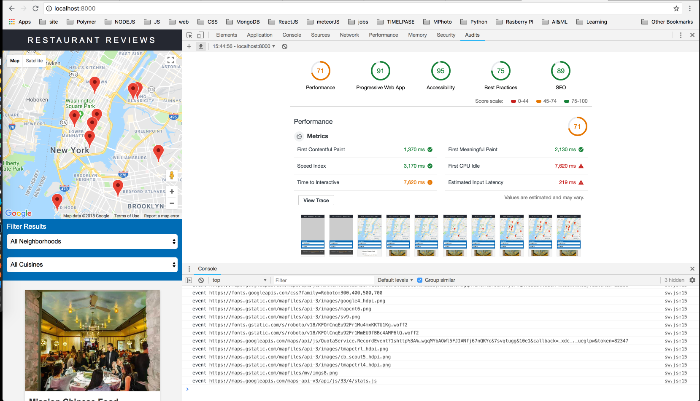

# Mobile Web Specialist Certification Course
---
#### _Three Stage Course Material Project - Restaurant Reviews_

## Project Overview: Stage 1

For the **Restaurant Reviews** projects, you will incrementally convert a static webpage to a mobile-ready web application. In **Stage One**, you will take a static design that lacks accessibility and convert the design to be responsive on different sized displays and accessible for screen reader use. You will also add a service worker to begin the process of creating a seamless offline experience for your users.

## Getting Started

```
npm install
npm run generate-images
npm start
```

Open [localhost:8000](http://localhost:8000)


## Project Overview: Stage 2

Project Overview
For the Restaurant Reviews projects, you will incrementally convert a static webpage to a mobile-ready web application. In Stage Two, you will take the responsive, accessible design you built in Stage One and connect it to an external server. You’ll begin by using asynchronous JavaScript to request JSON data from the server. You’ll store data received from the server in an offline database using IndexedDB, which will create an app shell architecture. Finally, you’ll work to optimize your site to meet performance benchmarks, which you’ll test using Lighthouse.

## Getting Started
Fork and clone the [server repository](https://github.com/udacity/mws-restaurant-stage-2). You’ll use this development server to develop your project code.

```
npm install
npm run generate-images
npm run build-assets
npm start
```
Node: make sure that on DBHelper.js port is set to the same port as your server port

LightHouse results: 
Please see [json](./lighthouse/8000-20180626T154031.json) form lightHouse folder(can be imported into chrome devtools)




